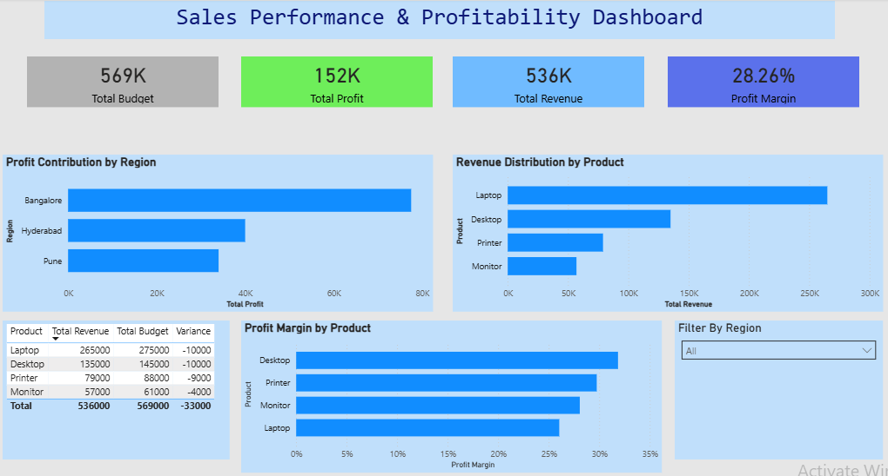

# 📊 Sales Dashboard (Power BI)

## 📌 Overview
This project presents an interactive Power BI dashboard for analyzing sales performance across regions, products, and time.

---

## 🛠 Tools Used
- Power BI

---

## 📁 Project Structure
- sales_dashboard.pbix → Power BI file  
- screenshots/ → dashboard preview  

---

## 📊 Dashboard Preview

---

## 🔍 Key Features

- Revenue trends over time  
- Region-wise performance  
- Product-wise analysis  
- KPI tracking  

---

## 💡 Insights

- Total revenue reached 536K with a profit of 152K, achieving a healthy profit margin of 28.26%.
- Overall performance fell short of budget by approximately 33K, indicating a gap between targets and actuals.
- Revenue is highly concentrated in a single product category, increasing business risk.
- Improving margins in high-revenue products like laptops can significantly boost overall profitability.
---

## 📌 Author
[Varun.B.Kalale]
